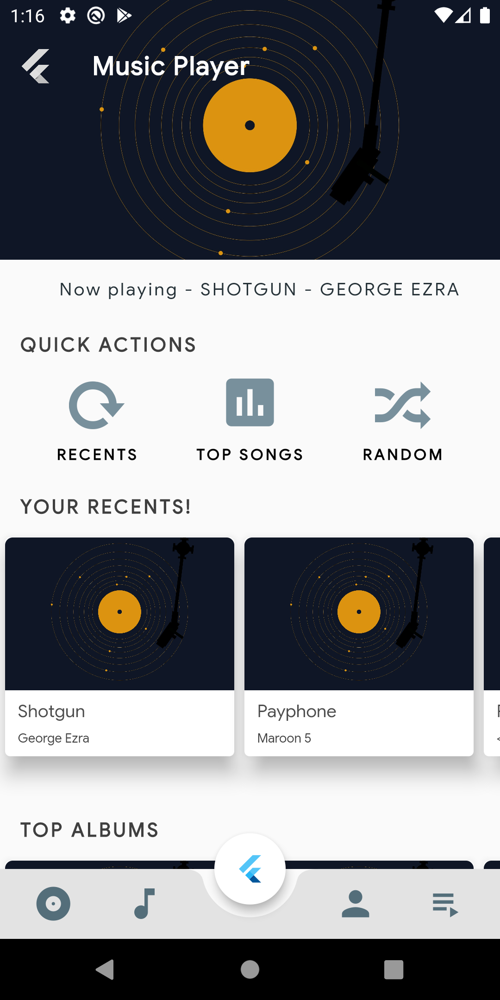
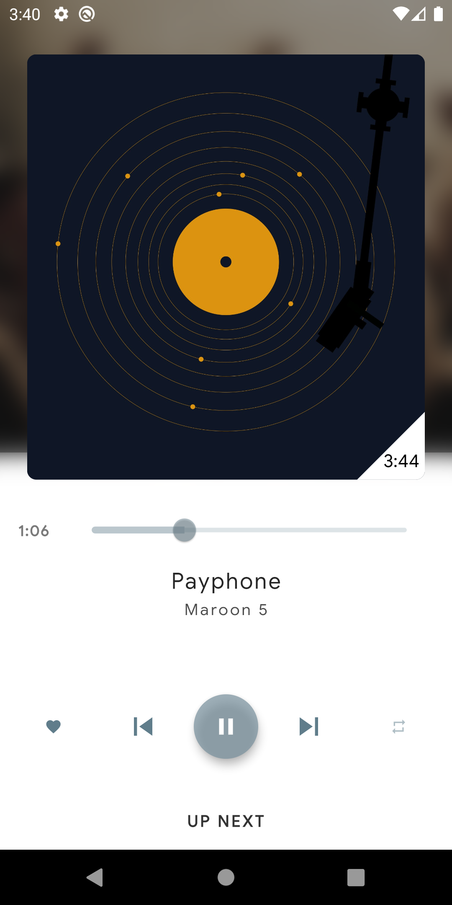
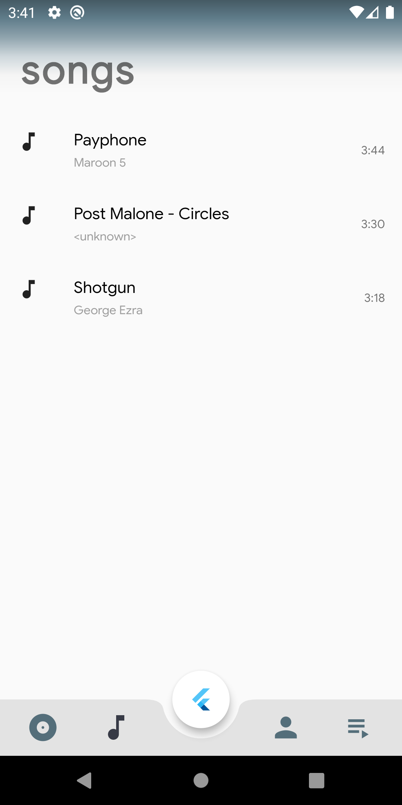
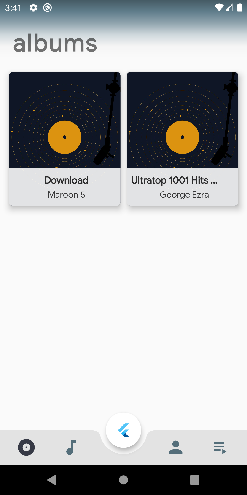
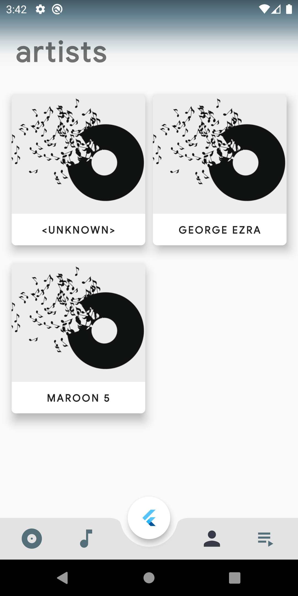
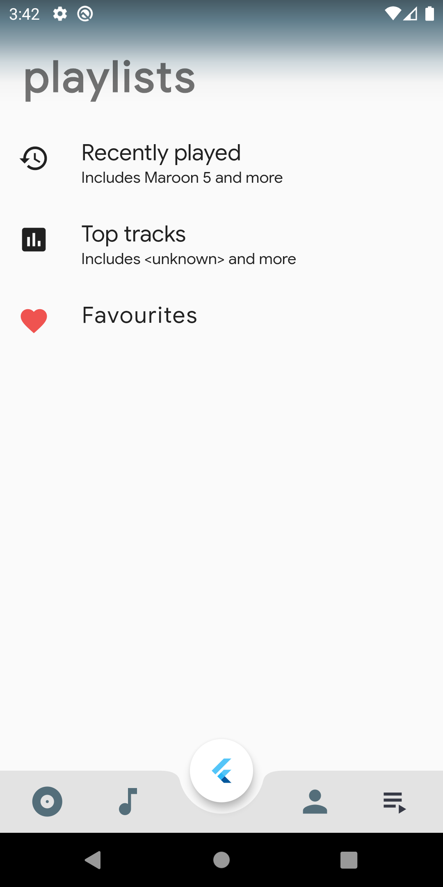
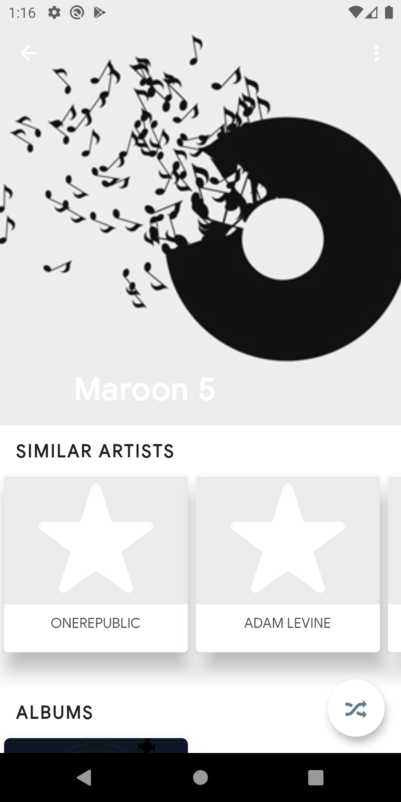
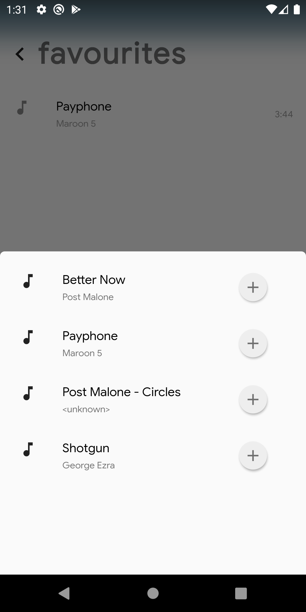

<h1 align="center">Music Player App</h1>

  

<h1>Project By</h1>

| <h3>Dhairya Shah</h3> | <h3>Peeya Thacker</h3> | <h3>Sameer Wadhwa</h3> |
| -------------------- | ---------------------- | ---------------------- |
| <h3>1911119 </h3>    | <h3>1911127</h3>       | <h3>1911131</h3>       |
| <h3>B4</h3>          | <h3>B4</h3>            | <h3>B4</h3>            |

<h1>Project Mentor</h1>

| <h3>Prof. Arcahana Gupta</h3> | 
| ------------------------------- |

# Prerequisites

  -   A system running Windows 10/Linux/MacOS
  -   Flutter SDK
  -   Android Studio / Visual Studio Code

# Running the project

-   Open the terminal/command prompt.
-   Clone the repository.
     
    -   `https://github.com/Sameer-W/mini-project-musicplayer`
-   Open the project using Andriod studio / Visual studio code
-   Run `flutter pub get` in terminal to install all package dependencies

# Screenshots

&nbsp; &nbsp; &nbsp; &nbsp;&nbsp; &nbsp;&nbsp; &nbsp;&nbsp; &nbsp; &nbsp; &nbsp;

&nbsp; &nbsp; &nbsp; &nbsp;&nbsp; &nbsp;&nbsp; &nbsp;&nbsp; &nbsp; &nbsp; &nbsp;

&nbsp; &nbsp; &nbsp; &nbsp;&nbsp; &nbsp;

# Tools and Technologies used

   &nbsp; &nbsp; 
   &nbsp; &nbsp; 
  

